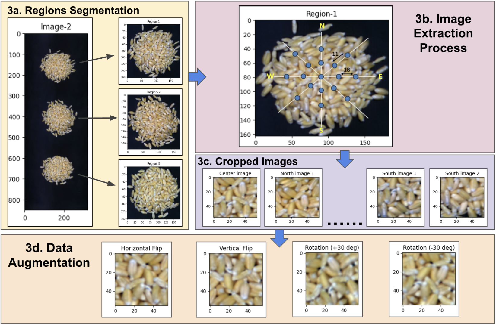
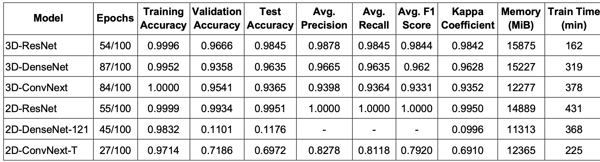

# 🌾 Hyperspectral Image Classification for Wheat Varieties

## 📌 Overview

The primary objective of the project is to classify the large varities of wheat seeds accurately and efficiently using Machine Learning techniques. Actually it is very difficult to accurately classify large varities of wheats using RGB images because of their very similar appearance. So, the hyperspectral imaging technique is used in this project. 

This repository presents a deep learning-based approach for classifying wheat varieties using hyperspectral imaging. The project leverages both **spectral** and **spatial** information to distinguish between **50 wheat varieties**, using advanced 2D and 3D convolutional neural network (CNN) architectures.

---

## 📊 Dataset

* **Classes**: 50 wheat varieties
* **Samples per class**: 2 hyperspectral images
* **Image dimensions**: `850 × 320 × 168` (Height × Width × Spectral Bands)
* **Source**: Collected from multiple regions across India

Each image captures rich spectral signatures, enabling fine-grained classification.

---

## ⚙️ Data Preparation Pipeline

The preprocessing pipeline ensures high-quality inputs for model training:

### 1. Pre-Processing

* Removed noisy spectral bands.
* Applied Otsu thresholding to get binary image.
* Got the dimensions of individual patches using binary image.


### 2. Region Segmentation

* The 3 circular patches are segmented from the original hyperspectral image.

### 3. Images Generation

* Using cropping in structred manner as shown, Extracted patches of fixed-size:

  * **56 × 56 × 147**
* Used as input samples for model training

### 4. Data Augmentation
* Applied 4 augmentation techniques on each image: Horizontal Flip, Vertical Flip, Rotation 30 deg clockwise and Rotation 30 deg anti-clockwise.




---

## 🧠 Models Implemented

The project implemented both **3D CNNs (spectral-spatial)** and **2D CNNs (spatial-only)**:

### 🔷 3D CNN Models (Spectral + Spatial Features)

* **3D ConvNeXt** 
* **3D DenseNet121** 
* **3D ResNet34** 

### 🔶 2D CNN Models (Spatial Features Only)

* **2D ConvNeXt**
* **2D DenseNet121**
* **2D ResNet34**


---

## Results

* Achieved 98.5% overall accuracy using the 3D ResNet model.
* 3D DenseNet and 3D ConvNeXt achieved accuracies of 96.6% and 93.9%, respectively.
* Overall, 3D models outperformed their 2D counterparts, delivering both higher accuracy and faster training times. Detailed results are presented in the figure below.




## Requirements

- Python 3.8+
- PyTorch
- Torchvision
- NumPy
- Pandas
- Matplotlib
- Scikit-learn
- Spectral Python (for hyperspectral data handling)
- Scikit-image

## Installation

1. Clone the repository:
```bash
git clone <repository-url>
cd Hyperspectral_Image_Classification_DL
```

2. Install required packages:
```bash
pip install torch torchvision numpy pandas matplotlib scikit-learn spectral scikit-image
```


## Acknowledgements

This project was completed as my M.Tech. Thesis Project under the guidance of Professor R. Balasubramanian Sir at IIT Roorkee. The project received close supervision from my Ph.D. supervisor, Mr. Nitin Tyagi. I am deeply grateful to both Professor R. Balasubramanian and Mr. Nitin Tyagi for their invaluable support and guidance throughout the entire project.

## License

This project is part of an academic thesis. Please contact the author for usage permissions.